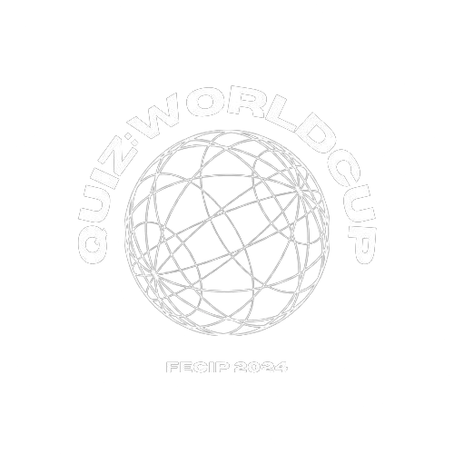

# 🏆 Quiz World Cup

<div align="center">



[](https://unity3d.com/unity/editor)
[](https://docs.microsoft.com/pt-br/dotnet/csharp/)
[](LICENSE)
[]()

*Uma experiência interativa de quiz desenvolvida para consolidar conhecimentos em Arquitetura de Sistemas no Unity*

</div>

---

## 📋 Sobre o Projeto

Quiz World Cup é um jogo de quiz interativo desenvolvido como projeto pessoal para estudo e prática de **arquitetura de sistemas** utilizando a **Unity Engine**. O projeto demonstra a aplicação de padrões de projeto para gerenciamento de UI e persistência de dados, resultando em uma aplicação robusta e escalável.

### 🎯 Objetivo

Criar uma experiência de quiz envolvente que demonstre boas práticas de desenvolvimento de jogos, incluindo:
- Arquitetura limpa e modular
- Persistência eficiente de dados
- Interface responsiva e intuitiva
- Experiência do usuário polida

---

## ✨ Funcionalidades

| Feature | Descrição |
|---------|-----------|
| 🔀 **Perguntas Aleatórias** | Pool de perguntas com seleção randômica para replayability |
| 🎮 **Feedback Hávido** | Resposta visual e háptica para cada interação do usuário |
| 🏆 **Highscore Persistente** | Sistema de pontuação salvo localmente com JSON |
| 📱 **Multi-Resolução** | Layout adaptativo para diferentes tamanhos de tela |
| ⚡ **Animações Suaves** | Transições e efeitos visuais com AOS.js |

---

## 🛠️ Tecnologias

<div align="center">

| Categoria | Tecnologia |
|-----------|------------|
| **Engine** | Unity 2022.3 LTS |
| **Linguagem** | C# Scripting |
| **UI** | UI Toolkit / Bootstrap 5 |
| **Fontes** | Plus Jakarta Sans |
| **Ícones** | Font Awesome 6.4 |
| **Animações** | AOS (Animate On Scroll) |
| **Persistência** | JSON |
| **Hospedagem** | Firebase Hosting |

</div>

---

## 🚀 Como Executar

### Opção 1: Jogar Online (Recomendado)

Acesse o jogo diretamente pelo navegador:

> 📥 **[Baixar e Jogar](https://drive.usercontent.google.com/download?id=1KZy1nf3vDmuQ8SuzGWp0ZVkL8FHFXK8B&export=download&authuser=0&confirm=t&uuid=26c77b48-9840-4e1b-aaec-7dc68ce4610b&at=AN8xHopOhj2V8KrgIkOaNovcfbZw:1753933977710)**

### Opção 2: Executar Localmente

1. **Clone o repositório:**
   ```bash
   git clone https://github.com/FBGdev/Quiz.git
   cd Quiz
   ```

2. **Instale as dependências:**
   ```bash
   # Se necessário, instale o Firebase CLI
   npm install -g firebase-tools
   ```

3. **Implemente no Firebase (opcional):**
   ```bash
   firebase deploy
   ```

4. **Abra o projeto:**
   - Abra a pasta `public/` em seu navegador
   - Ou utilize um servidor local:
     ```bash
     npx serve public/
     ```

---

## 📁 Estrutura do Projeto

```
Quiz/
├── .firebaserc           # Configuração do Firebase
├── .gitignore            # Arquivos ignorados pelo Git
├── firebase.json         # Configuração de deployment
├── public/               # Arquivos públicos
│   ├── index.html        # Página principal
│   ├── 404.html          # Página de erro 404
│   └── src/
│       └── logo.png      # Logo do projeto
└── README.md             # Este arquivo
```

---

## 🎨 Design

O projeto apresenta um design moderno com:

- **Glassmorphism** - Interface com efeito de vidro translúcido
- **Gradientes** - Combinação de cores modernas (azul ciano ao azul escuro)
- **Animações** - Transições suaves com AOS
- **Tipografia** - Plus Jakarta Sans para leitura confortável
- **Responsividade** - Layout adaptativo com Bootstrap 5

---

## 📊 Aprendizados

Este projeto serviu para explorar e consolidar:

✅ Padrões de Projeto (Design Patterns)  
✅ Arquitetura de Software em Jogos  
✅ Gerenciamento de Estados  
✅ Persistência de Dados com JSON  
✅ UI/UX para Aplicações Interativas  
✅ Integração com Serviços Cloud (Firebase)

---

## 🤝 Conecte-se

Gosta de desenvolvimento de jogos? Vamos trocar ideias!

<div align="center">

[](https://linkedin.com/in/fabianodev)
[](mailto:fabianodev@yahoo.com)
[](https://wa.me/5521983304162?text=Ol%C3%A1%21%20Vim%20pelo%20seu%20portf%C3%B3lio%20e%20gostaria%20de%20conversar.)
[](https://github.com/FBGdev)

</div>

---

## 📝 Licença

Este projeto está sob a licença MIT. Veja o arquivo [LICENSE](LICENSE) para mais detalhes.

---

<div align="center">

Desenvolvido com ❤️ por **[Fabiano Gonçalves](https://linkedin.com/in/fabianodev)**

*© 2026 Todos os direitos reservados*

</div>

